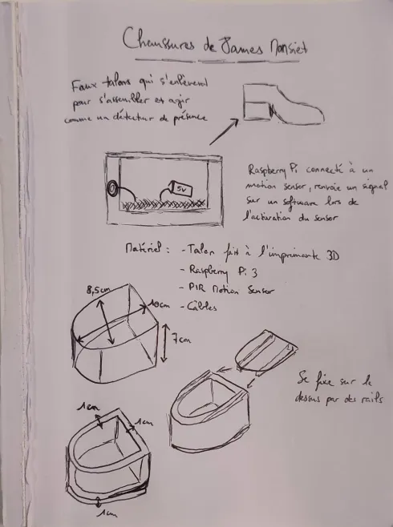
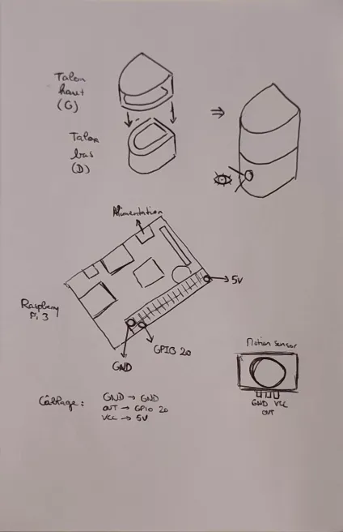
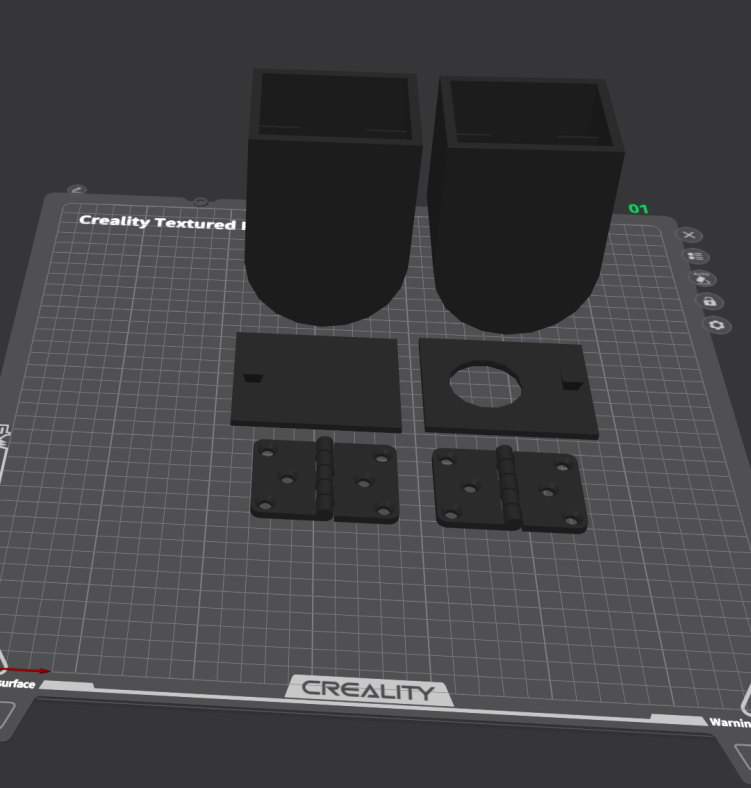
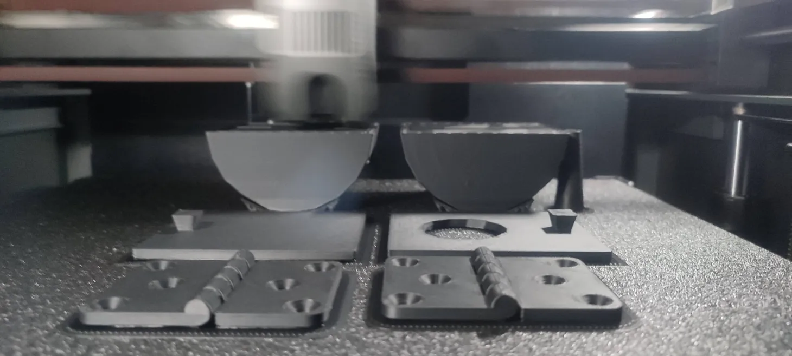

[⬅️ Retour au README](../../README.md)

# 📚 Annexes

---

## 📐 Schéma des talons avant impression
  

---

## 🧩 Modèle 3D des talons
  
.webp)  
.webp)

---

## 🖨️ Impression des talons dans l'imprimante 3D

---

## 🌐 Capture d'écran du site en action

---

## 🔌 Schéma câblage PIR → Raspberry Pi
*(à compléter)*

---

# ✅ Annexes complémentaires

### 📋 Checklist Démo
- [x] Prototype alimenté (batterie portable testée)  
- [x] Capteur PIR câblé et fixé  
- [x] Script Python fonctionnel  
- [x] Connexion Wi-Fi MyDil OK  
- [x] Site web accessible  
- [x] Envoi JSON avec timestamp validé  
- [x] Journalisation locale activée  
- [x] Vidéo de démo prête  
- [x] Slides prêtes  
- [ ] Timelapse finalisé  
- [x] Aplatir la porte de la batterie avec un tournevis chauffé pour ouvrir/fermer sans problème  

---

# 📚 Ressources utilisées
- [Circuit Design App for Makers - circuito.io](https://www.circuito.io "Circuito")  
- Librairie Python `gpiozero` pour le PIR  
- Maya et Creality pour la modélisation 3D  

---

## ⚙️ Stack Technique

| 💻 Composant     | 🔧 Technologie             |
| ---------------- | -------------------------- |
| Site web front   | React TS, Tailwind CSS, Vite |
| API              | NextJS                     |
| Base de données  | Supabase                   |
| Hébergement      | Vercel                     |
